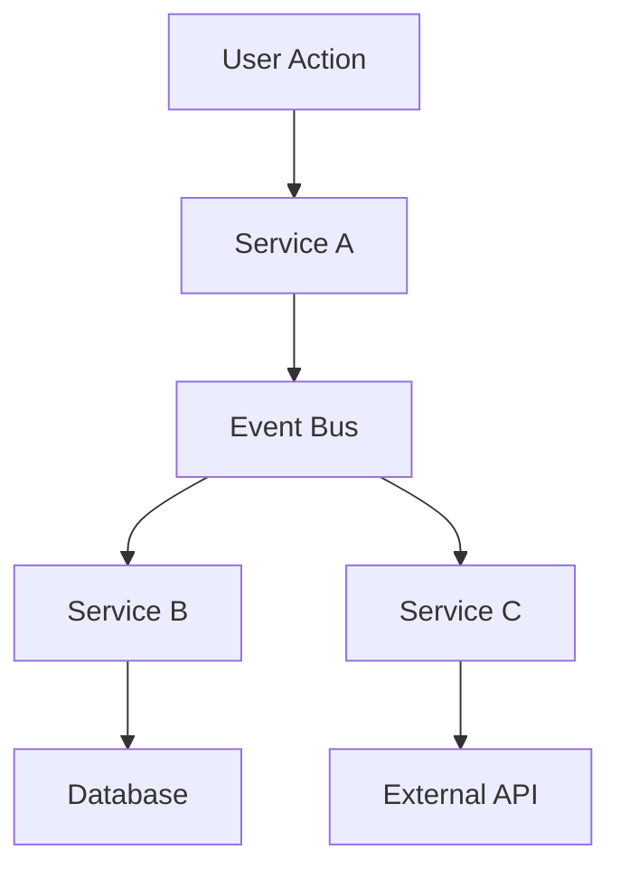

# Microservices Architecture Overview

## Executive Summary

This document outlines the complete microservices architecture for our event-driven platform. The system consists of 11 specialized microservices designed to handle different aspects of the business domain, from user management to AI processing and content management.

## Architecture Principles

### Event-Driven Design
- **Asynchronous Communication**: Services communicate through events via RabbitMQ
- **Loose Coupling**: Services are independent and can be developed, deployed, and scaled separately
- **Event Sourcing**: Key business events are captured and stored for audit and replay capabilities
- **CQRS Pattern**: Command and Query responsibilities are separated where appropriate

### Technology Stack
- **Backend Framework**: Flask 3.0 with Python 3.11
- **Database**: PostgreSQL 15 with SQLAlchemy 2.0
- **Message Broker**: RabbitMQ 3.x with management interface
- **Caching**: Redis 7.x for session storage and caching
- **API Gateway**: API Six for routing and load balancing
- **Identity Provider**: Keycloak for centralized authentication
- **Containerization**: Docker with multi-stage builds
- **Orchestration**: Kubernetes with health checks and auto-scaling

### Security Model
- **Authentication**: JWT tokens issued by Keycloak
- **Authorization**: Role-Based Access Control (RBAC) with fine-grained permissions
- **Service Communication**: No service-level authentication except User Management Service
- **Network Security**: Services communicate within secure private networks
- **Data Protection**: Encryption at rest and in transit

## Service Catalog

### Core Services

#### 1. User Management Service
- **Port**: 5001
- **Database**: user_management
- **Purpose**: Centralized user authentication, authorization, and profile management
- **Key Features**:
  - User registration and login
  - Password management with security policies
  - Role and permission management (RBAC)
  - Email verification and account recovery
  - User profile management
  - Account lockout and security monitoring

**Models**: User, UserProfile, Role, Permission, RolePermission, InvitationCode

**API Endpoints**:
- `POST /api/v1/users/register` - User registration
- `POST /api/v1/users/login` - User authentication
- `GET /api/v1/users/profile` - Get user profile
- `PUT /api/v1/users/profile` - Update user profile
- `POST /api/v1/users/change-password` - Change password
- `GET /api/v1/roles` - List available roles
- `POST /api/v1/users/{id}/roles` - Assign role to user

#### 2. Workspace Management Service
- **Port**: 5002
- **Database**: workspace_management
- **Purpose**: Manage collaborative workspaces and team organization
- **Key Features**:
  - Workspace creation and configuration
  - Member management with role-based permissions
  - Storage quota management
  - Workspace themes and customization
  - Activity tracking

**Models**: Workspace, WorkspaceMember (association table)

**API Endpoints**:
- `POST /api/v1/workspaces` - Create workspace
- `GET /api/v1/workspaces` - List user workspaces
- `GET /api/v1/workspaces/{id}` - Get workspace details
- `PUT /api/v1/workspaces/{id}` - Update workspace
- `POST /api/v1/workspaces/{id}/members` - Add member
- `DELETE /api/v1/workspaces/{id}/members/{user_id}` - Remove member

#### 3. Article Management Service
- **Port**: 5003 (updated from conflicting port)
- **Database**: article_management
- **Purpose**: Content creation, editing, and publishing workflow
- **Key Features**:
  - Rich content editing with markdown support
  - SEO optimization tools
  - Content versioning
  - Publishing workflow with approval process
  - Content analytics and engagement metrics

**Models**: Article, ArticleVersion, ContentCategory, Tag

**API Endpoints**:
- `POST /api/v1/articles` - Create article
- `GET /api/v1/articles` - List articles
- `GET /api/v1/articles/{slug}` - Get article by slug
- `PUT /api/v1/articles/{id}` - Update article
- `POST /api/v1/articles/{id}/publish` - Publish article
- `GET /api/v1/articles/featured` - Get featured articles

### Domain-Specific Services

#### 4. Domain Management Service
- **Port**: 5004
- **Database**: domain_management
- **Purpose**: Domain registration, DNS management, and WordPress integration
- **Key Features**:
  - Domain registration and renewal
  - DNS record management
  - WordPress site provisioning
  - SSL certificate management
  - Domain analytics

**Models**: Domain, WordPressSite, DomainRecord, SSLCertificate

#### 5. AI Configuration Service
- **Port**: 5005
- **Database**: ai_configuration
- **Purpose**: AI model configuration and provider management
- **Key Features**:
  - AI model provider configuration
  - API key management
  - Model performance monitoring
  - Cost tracking and optimization
  - A/B testing for different models

**Models**: AIModel, Configuration, ModelProvider, APIKey

#### 6. Image Generation Service
- **Port**: 5006
- **Database**: image_generation
- **Purpose**: AI-powered image generation and processing
- **Key Features**:
  - Image generation via multiple AI providers
  - Template management
  - Image optimization and formats
  - Generation history and analytics
  - Batch processing capabilities

**Models**: ImageRequest, GeneratedImage, ImageTemplate, GenerationJob

### Infrastructure Services

#### 7. Monitoring Service
- **Port**: 5007
- **Database**: monitoring
- **Purpose**: System health monitoring and alerting
- **Key Features**:
  - Service health checks
  - Performance metrics collection
  - Alert management
  - Dashboard for system overview
  - SLA monitoring

**Models**: ServiceHealth, Metric, Alert, Dashboard

#### 8. Notification Service
- **Port**: 5008
- **Database**: notifications
- **Purpose**: Multi-channel notification delivery
- **Key Features**:
  - Email notifications
  - SMS notifications
  - Push notifications
  - In-app notifications
  - Template management
  - Delivery tracking

**Models**: Notification, NotificationTemplate, NotificationChannel, DeliveryLog

#### 9. Logging Service
- **Port**: 5009
- **Database**: logging
- **Purpose**: Centralized logging and audit trails
- **Key Features**:
  - Structured logging
  - Log aggregation from all services
  - Audit trail for sensitive operations
  - Log search and filtering
  - Retention policies

**Models**: LogEntry, AuditLog, SystemEvent, LogConfig

#### 10. Configuration Service
- **Port**: 5010
- **Database**: configuration
- **Purpose**: Global configuration and secrets management
- **Key Features**:
  - Environment-specific configurations
  - Secret management with encryption
  - Configuration versioning
  - Dynamic configuration updates
  - Configuration validation

**Models**: ConfigurationItem, Environment, Secret, ConfigVersion

### External Services

#### 11. Scraping Service
- **Port**: 5011
- **Database**: scraping
- **Purpose**: External data collection and processing
- **Key Features**:
  - Web scraping jobs
  - Data extraction and transformation
  - Scheduled scraping tasks
  - Rate limiting and respectful crawling
  - Data quality validation

**Models**: ScrapingJob, ScrapedData, Source, ScrapingSchedule

#### 12. AI Rate Limiter Service
- **Port**: 5012
- **Database**: ai_rate_limiter
- **Purpose**: AI API usage quotas and rate limiting
- **Key Features**:
  - Per-user rate limiting
  - API quota management
  - Usage analytics
  - Cost control and budgeting
  - Fair usage policies

**Models**: RateLimit, Usage, Quota, UsageStats

## Event Architecture

### Event Flow Patterns



### Key Events

#### User Events
- `user.created` - New user registration
- `user.activated` - User email verification completed
- `user.role_changed` - User role or permissions updated
- `user.login` - User authentication successful
- `user.logout` - User session ended

#### Workspace Events
- `workspace.created` - New workspace created
- `workspace.member_added` - Member invited to workspace
- `workspace.member_removed` - Member removed from workspace
- `workspace.settings_updated` - Workspace configuration changed

#### Content Events
- `article.created` - New article created
- `article.published` - Article published
- `article.updated` - Article content modified
- `article.viewed` - Article viewed by user

#### System Events
- `service.health_check` - Service health status update
- `system.configuration_changed` - Global configuration updated
- `security.suspicious_activity` - Security alert triggered

## Database Schema Patterns

### Common Fields
All models inherit from `BaseModel` which provides:
```python
id: UUID (Primary Key)
created_at: DateTime
updated_at: DateTime
is_deleted: Boolean (Soft Delete)
deleted_at: DateTime
metadata_json: Text (Additional metadata)
```

### Relationships
- **User ←→ Workspace**: Many-to-many through workspace_members table
- **User ←→ Article**: One-to-many (author relationship)
- **Workspace ←→ Article**: One-to-many (workspace content)
- **User ←→ Role**: Many-to-many (RBAC permissions)

## Security Architecture

### Authentication Flow
1. User authenticates with Keycloak
2. Keycloak issues JWT token
3. API Gateway validates JWT for all requests
4. Services trust API Gateway authentication

### Authorization Levels
- **Public**: Health checks, documentation
- **Authenticated**: Basic user operations
- **Role-Based**: Admin functions, sensitive operations
- **Workspace-Based**: Workspace-specific permissions

## Development Guidelines

### Service Standards
- **Health Checks**: All services implement `/health`, `/health/ready`, `/health/live`
- **Logging**: Structured logging with correlation IDs
- **Error Handling**: Consistent error response format
- **API Versioning**: All APIs use `/api/v1/` prefix
- **Documentation**: OpenAPI/Swagger documentation for all endpoints

### Testing Strategy
- **Unit Tests**: Individual function and method testing
- **Integration Tests**: Database and external service interactions
- **Contract Tests**: API contract validation between services
- **End-to-End Tests**: Complete user workflow testing

### Deployment Pipeline
1. **Development**: Local development with Docker Compose
2. **Testing**: Automated testing in CI/CD pipeline
3. **Staging**: Full environment testing with production-like data
4. **Production**: Blue-green deployment with health checks

## Monitoring and Observability

### Metrics Collection
- **Service Metrics**: Response time, error rate, throughput
- **Business Metrics**: User registrations, article views, workspace activity
- **Infrastructure Metrics**: CPU, memory, disk usage
- **Database Metrics**: Connection pool, query performance

### Alerting Rules
- **Critical**: Service down, database connection lost
- **Warning**: High error rate, slow response times
- **Info**: Unusual activity patterns, quota approaching limits

## Scaling Considerations

### Horizontal Scaling
- **Stateless Services**: All services designed to be stateless
- **Load Balancing**: API Gateway distributes load across instances
- **Database Connections**: Connection pooling prevents database overload
- **Message Queues**: RabbitMQ clustering for high availability

### Performance Optimization
- **Caching**: Redis for frequently accessed data
- **Database Indexing**: Optimized indexes for common queries
- **Async Processing**: Background jobs for heavy operations
- **CDN**: Static content delivery optimization

## Future Enhancements

### Planned Features
- **GraphQL Gateway**: Unified data access layer
- **Service Mesh**: Istio for advanced traffic management
- **Event Streaming**: Apache Kafka for high-throughput events
- **Machine Learning**: Real-time recommendation engine

### Migration Strategy
- **Gradual Migration**: Incremental service extraction
- **Feature Toggles**: Safe feature rollout mechanism
- **Data Migration**: Zero-downtime database migrations
- **Rollback Procedures**: Quick rollback for failed deployments

## Conclusion

This microservices architecture provides a robust, scalable, and maintainable foundation for our platform. The event-driven design ensures loose coupling between services while maintaining data consistency and system reliability. Each service is designed with production-ready features including comprehensive monitoring, security, and deployment automation.

The architecture supports both current requirements and future growth, with clear patterns for adding new services and scaling existing ones. The standardized approaches to configuration, logging, and health monitoring ensure operational consistency across all services.